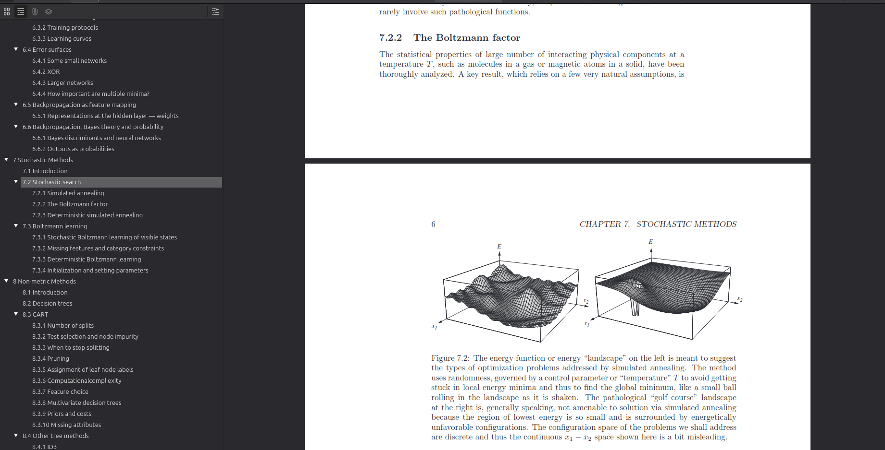

# Pattern Classification by Duda (2nd Edition, 2000) with Outline

This repository contains a Python script that adds a detailed outline (bookmarks) to the PDF of the book *Pattern Classification* (2nd Edition, 2000) by Duda.

[**Pattern Classification Duda (With Outline).pdf**](Pattern%20Classification%20Duda%20(With%20Outline).pdf)

## Screenshot

Below is a screenshot showcasing the outline added to the PDF:

